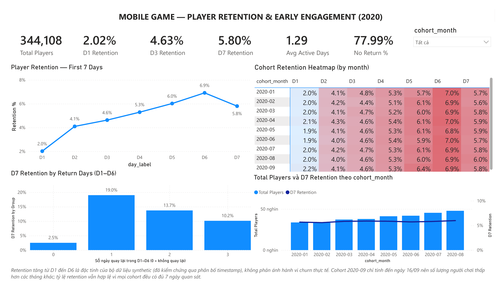

# Mobile Game — Player Retention & Early Engagement Analysis

Identifying early player drop-off patterns during the first 7 days after registration.

**Core question:** *What early engagement patterns are associated with Day-7 player retention?*

---

## Dataset & stack

**Gamelytics: Mobile Analytics Challenge** ([Kaggle](https://www.kaggle.com/datasets/debs2x/gamelytics-mobile-analytics-challenge)) — 1,000,000 registration records and 9,601,013 authentication records (`uid` + Unix timestamps only).

**Analysis scope:** registration cohorts from 2020-01-01 to 2020-09-16 — **344,108 players**.

BigQuery (SQL) → Python / Pandas → Power BI → GitHub



---

## Method

- **Right-censoring control** — cohorts registering within 7 days of the dataset's end are excluded (10,855 players), since they never had a full observation window.
- **Shared cohort** — numerator and denominator both join against the same filtered cohort table, preventing a mismatch.
- **Leakage-free feature** — return days count D1–D6 only, excluding D7 (the label) and D0 (where nearly everyone is active).

Python and SQL implementations were cross-validated and produce identical results.

---

## Key findings

| Metric | Value |
|---|---|
| D1 / D3 / D7 retention | 2.02% / 4.63% / 5.80% |
| Average active days (D0–D6) | 1.29 |
| Players who never returned during D1–D6 | **77.99%** (268,385) |

**1 — Most players never return.** Nearly four in five players show no activity between D1 and D6. This dominates every other retention effect in the dataset.

**2 — A single return visit separates retained from lost players.**

| Return days (D1–D6) | Players | D7 retention |
|---|---|---|
| 0 | 268,385 | 2.53% |
| 1 | 54,222 | **19.02%** |
| 2 | 19,120 | 13.73% |
| 3 | 2,293 | 10.16% |

Returning at least once is associated with ~7.5× higher D7 retention. The relationship peaks at one return day and declines thereafter — the meaningful threshold is *returning at all*, not *returning often*.

**3 — Retention held flat as acquisition grew.** Monthly registrations rose 41.9% (33,733 → 47,882) while D7 retention stayed within 5.58%–5.99% across all nine cohorts.

**Data quality finding — the retention curve is not organically shaped.** The curve rises from D1 (2.02%) to D6 (6.92%) before dipping at D7, rather than decaying monotonically. This is not a calculation error: Pandas and SQL implementations match, restricting to 2020 doesn't change it, registration volume is evenly distributed with no anomalous clusters, and weekly cohorts show the same pattern (1.2pp range across 38 weeks). The synthetic timestamps appear not to model organic churn, so this shape is treated as a structural property of the dataset — no product interpretation is drawn from it.

---

## Recommendations

1. **Prioritise the first return visit.** The strongest discontinuity is between zero and one return day, targeting the largest addressable segment — the 78% who never come back.
2. **Adopt "no-return rate" as a headline KPI** alongside D1/D7. It communicates early-lifecycle health more directly than the curve, given how concentrated the loss is.
3. **Instrument gameplay telemetry.** This data shows *that* and *when* players leave, not *why*. Tutorial completion, session duration, and level progression would be needed for causal diagnosis.
4. **Monitor retention as a guardrail** if acquisition spend increases further.
5. **Validate against production data before acting.** The analytical framework transfers; the specific magnitudes should not be treated as benchmarks.

---

## Limitations

- Authentication records are a **proxy for activity** — a login is not necessarily a gameplay session.
- No session duration, gameplay events, level progression, or purchase data. Findings are **associations, not causes**.
- Registration timestamps span 1998–2020, with ~5.8% predating 2016 — implausible for a mobile game. Analysis is restricted to 2020 cohorts.
- Cohorts without a full 7-day observation window are excluded.
- The retention curve does not decay monotonically, indicating **synthetic data that does not model organic churn**. Results demonstrate analytical method rather than real player behaviour.
- The 2020-09 cohort covers only 1–16 September; its retention rates are valid, but its registration volume is not comparable to full months.

---

## Repository structure

```
gamelytics-player-retention-analysis/
├── README.md
├── sql/
│   ├── 1_data_quality.sql              
│   ├── 2_registration_activity.sql     
│   ├── 3_retention.sql
│   ├── 4_engagement.sql
│   └── 5_cohort.sql
├── notebooks/
│   └── retention.py
├── screenshots/                      
│   ├── timestamp_distribution.png
│   ├── retention_curve.png
│   ├── new_players_vs_d7.png
│   ├── engagement.png
│   └── cohort_heatmap.png
└── dashboard/
    ├── retention.pbix
    └── dashboard.png
```
